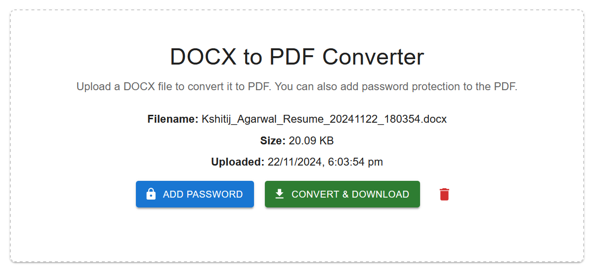

# DOCX TO PDF Document Converter - Visual Guide

This guide provides a visual walkthrough of the DOCS TO PDF Document Converter application, showing how to use its features and what to expect at each step.

## Application Interface & Features

### 1. Home Page

The home page provides a clean and intuitive interface with:
- File upload button to select your DOCX document
- Password protection option for securing your PDF
- Convert button to start the conversion process
- Status display area for conversion progress

### 2. Password Protection Feature

Adding security to your PDF:
1. Click "Choose File" to select your DOCX document
2. Enter a password in the "Password Protection" field
3. Click "Convert" to create a password-protected PDF

### 3. Successful Conversion

When conversion completes successfully:
- Success message is displayed
- Download button appears
- File details are shown
- Original and converted file sizes are displayed

### 4. Encrypted File Result

When opening a password-protected PDF:
- PDF reader will prompt for the password
- File remains secure until correct password is entered
- Prevents unauthorized access to sensitive documents

